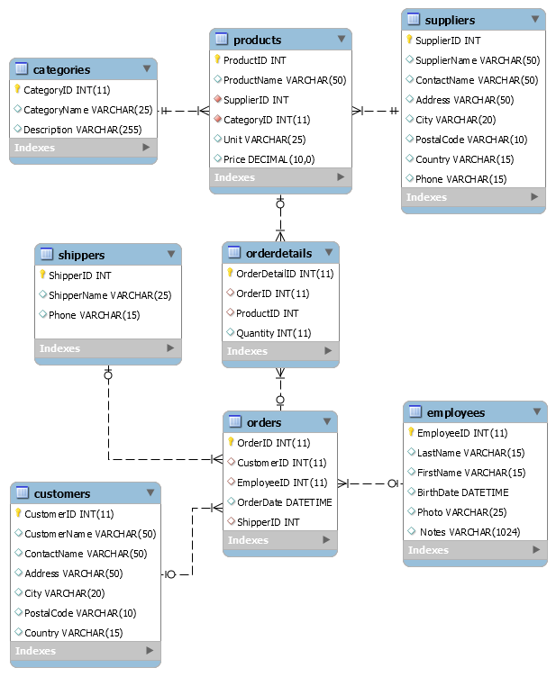

# **NorthWind_ETL Project Documentation**

The objective of this project is to analyze sales data from the NorthWind dataset using Snowflake. The analysis aims to uncover insights into sales trends, customer behavior, and product performance through the implementation of ETL processes and data visualizations.

---

## **1. Data Sources**
The NorthWind dataset contains the following tables:

- **Customers**: Information about customers, such as names, addresses, and contact details.
- **Categories**: Product categories and their descriptions.
- **Products**: Product details, including prices, categories, and suppliers.
- **Orders**: Customer orders, including order dates and customer IDs.
- **Order Details**: Details of each order, such as quantities and prices.
- **Suppliers**: Information about suppliers, including names and addresses.

---

### **1.1 Data architecture**
The ERD diagram below illustrates the relationships between these tables:

|  |
|:-:|
|*Figure 1: Entity-Relationship Diagram of NorthWind Dataset*|

---

## **2. Dimensional Model**
The project employs a star schema design with a central fact table connected to several dimension tables.

### Fact Table:
- **Sales Fact**:
    - **Metrics**: `total_revenue`, `quantity`

### Dimension Tables:
- **dim_customer**: Contains customer details like `customer_name` and `country`.
- **dim_product**: Contains product details, including `product_name` and `price`.
- **dim_time**: Time-based information like `year`, `month`, and `quarter`.
- **dim_supplier**: Information about product suppliers, including `supplier_name` and `country`.
- **dim_category**: Product category details like `category_name`.

The structure of the star schema model is depicted in the diagram below

|  |
|:-:|
|*Figure 2: Star Schema Structure*|

---

## 3. ETL Process in Snowflake

The ETL process involves extracting raw data from source files, transforming it into analytical-friendly structures, and loading it into the dimensional model for analysis. Below is the step-by-step explanation of the process:

### **3.1 Extract (Data Extraction)**

#### **Stage Creation**
A Snowflake `stage` was created to temporarily store `.csv` files:
```sql
CREATE OR REPLACE STAGE data_stage FILE_FORMAT = (TYPE = 'CSV' FIELD_OPTIONALLY_ENCLOSED_BY = '"');
```

#### **Staging Table Creation**
Staging tables were created for each dataset to store raw data temporarily. Example for `customers_staging`:
```sql
CREATE OR REPLACE TABLE customers_staging (
    id INT,
    customerName STRING,
    contactName STRING,
    address STRING,
    city STRING,
    postalCode STRING,
    country STRING
);
```

#### **Data Loading**
Data from `.csv` files was loaded into staging tables:
```sql
COPY INTO customers_staging
FROM @data_stage/Customers.csv
FILE_FORMAT = (TYPE = 'CSV' FIELD_OPTIONALLY_ENCLOSED_BY = '"' SKIP_HEADER = 1);
```
This step was repeated for all staging tables, including `products_staging`, `orders_staging`, and others.

---

### **3.2 Transform (Data Transformation)**

#### **Dimension Tables Creation**
Data from staging tables was cleaned and transformed into dimension tables:

1. **dim_customer**
   - Contains customer details like name, address, and country.
   ```sql
   CREATE OR REPLACE TABLE dim_customer AS
   SELECT
       id AS customer_id,
       customerName AS customer_name,
       contactName AS contact_name,
       address,
       city,
       postalCode AS postal_code,
       country
   FROM customers_staging;
   ```

2. **dim_product**
   - Combines product and category data.
   ```sql
   CREATE OR REPLACE TABLE dim_product AS
   SELECT
       id AS product_id,
       productName AS product_name,
       supplierId AS supplier_id,
       categoryId AS category_id,
       unit,
       price
   FROM products_staging;
   ```

3. **dim_time**
   - Organizes date information for time-based analysis.
   ```sql
   CREATE OR REPLACE TABLE dim_time AS
   SELECT
       ROW_NUMBER() OVER (ORDER BY TO_DATE(orderDate)) AS date_id,
       TO_DATE(orderDate) AS order_date,
       EXTRACT(YEAR FROM TO_DATE(orderDate)) AS year,
       EXTRACT(MONTH FROM TO_DATE(orderDate)) AS month,
       EXTRACT(DAY FROM TO_DATE(orderDate)) AS day,
       EXTRACT(QUARTER FROM TO_DATE(orderDate)) AS quarter
   FROM orders_staging;
   ```

4. **dim_supplier**
   - Stores supplier contact and location details.
   ```sql
   CREATE OR REPLACE TABLE dim_supplier AS
   SELECT
       id AS supplier_id,
       supplierName AS supplier_name,
       contactName AS contact_name,
       address,
       city,
       postalCode AS postal_code,
       country,
       phone
   FROM suppliers_staging;
   ```

5. **dim_category**
   - Contains category names and descriptions.
   ```sql
   CREATE OR REPLACE TABLE dim_category AS
   SELECT
       id AS category_id,
       category_name,
       description
   FROM categories_staging;
   ```

#### **Fact Table Creation**
The `fact_orders` table integrates data from dimension tables for analytical purposes:
```sql
CREATE OR REPLACE TABLE fact_orders AS
SELECT
    od.orderId AS order_id,
    o.customerId AS customer_id,
    o.employeeId AS employee_id,
    od.productId AS product_id,
    od.quantity,
    od.quantity * p.price AS total_revenue,
    TO_DATE(orderDate) AS order_date
FROM order_details_staging od
JOIN orders_staging o ON od.orderId = o.id
JOIN products_staging p ON od.productId = p.id;
```

---

### **3.3 Load (Data Loading)**

After the transformations, the staging tables were dropped to optimize storage:
```sql
DROP TABLE IF EXISTS customers_staging;
DROP TABLE IF EXISTS products_staging;
DROP TABLE IF EXISTS orders_staging;
DROP TABLE IF EXISTS order_details_staging;
DROP TABLE IF EXISTS suppliers_staging;
DROP TABLE IF EXISTS categories_staging;
```

This completed the ETL process, resulting in a dimensional model ready for analysis.